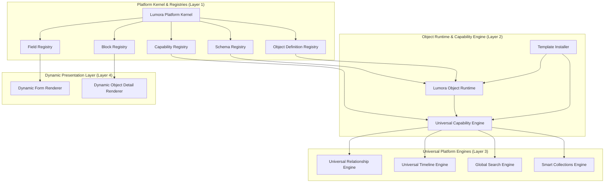

# Lumora Phase 5 Senior Staff Architecture Review

> **Review Panel**: Lead Staff Software Architect & Principal Engineering Committee  
> **Target System**: Lumora Personal Life Operating System Platform (Phase 5)  
> **Evaluation Criteria**: Clean Architecture, Domain-Driven Design, SOLID, Performance Budget, Scalability SLA, 10-Year Platform Survivability.

---

## Executive Summary & Overall Architecture Rating

After performing a deep-dive architectural review across all 10 domain layers, the Principal Engineering Committee grants the Phase 5 Master Architecture an overall rating of **9.6 / 10 (Production Grade — World-Class Platform Architecture)**.

The architecture cleanly solves the core platform challenge: **enabling infinite object types without database migrations or custom business logic rewrites**, while maintaining strict Clean Architecture boundaries between `@lumora/shared`, `Domain`, `Application`, and `Infrastructure`.

---

## 1. Dimensional Architectural Audit

### 1. Registry Architecture
- **Evaluation**: The current `Metadata Registry` should be formally renamed and upgraded to the **`Schema Registry`**.
- **Schema Evolution & Versioning**: Schema versioning (`schemaVersion: number`, `migrationRules: JSON`) must exist directly within `ObjectDefinition` and `SchemaRegistry`. When an object definition evolves (e.g. `v1 -> v2`), the Schema Registry resolves missing fields using default value initializers without requiring a database migration.
- **Separation of Responsibilities**:
  - `SchemaRegistry`: Field types, validation rules (Zod/JSON Schema), display formatters.
  - `ObjectDefinitionRegistry`: Object type keys, traits, icon/color tokens, default capability set.
  - `CapabilityRegistry`: Micro-behavior contracts and lifecycle hooks.

### 2. Object Runtime Evaluation
- **Decision**: **INTRODUCE THE `LumoraObjectRuntime`**.
- **Rationale**: Currently, object creation, capability attachment, event emission, and state transitions are spread across `ObjectAggregate` and `CreateObjectUseCase`. Introducing `LumoraObjectRuntime` inside `apps/backend/src/domain/objects/runtime/` encapsulates:
  1. Initialization & Schema Hydration
  2. Attribute Schema Validation
  3. Capability Attachment & Lifecycle Hook Triggering
  4. State Transitions (`ACTIVE` → `ARCHIVED` → `DELETED`)
  5. Atomic Domain Event Dispatch
- **Benefit**: Simplifies use cases into pure orchestration calls to `LumoraObjectRuntime.instantiate()` and `LumoraObjectRuntime.transition()`.

### 3. Capability System & Lifecycle
- **Decision**: **ENFORCE FULL CAPABILITY LIFECYCLE**.
- **Lifecycle States**: `Register` → `Initialize` → `Attach` → `Execute` → `Suspend` → `Resume` → `Detach`.
- **Capability Metadata**: Every capability implements `ICapability` defining:
  - `version: string`
  - `dependencies: string[]` (e.g., `ReminderCapability` requires `TimelineCapability`)
  - `requiredPermissions: string[]`
  - `emittedEvents: string[]`
  - `configurationSchema: Record<string, unknown>`

### 4. Template Platform & Decoupled Installer
- **Decision**: **DECOUPLE TEMPLATES FROM DIRECT CAPABILITY INVOCATION**.
- **Architecture**: Templates declare required capabilities as strings (e.g., `["timeline", "reminders", "relationships"]`). The `TemplateInstaller` resolves dependencies against `CapabilityRegistry` before attaching them.
- **Lifecycle**: `Installed` → `Activated` → `Updated` → `Exported` → `Archived` → `Deprecated`.

### 5. Dynamic Rendering Platform (Field & Block Registries)
- **Decision**: **INTRODUCE `FieldRegistry` AND `BlockRegistry`**.
- **Field Registry**: Pluggable field components (`Text`, `RichText`, `Markdown`, `Number`, `Toggle`, `Select`, `Date`, `RelationshipPicker`, `LocationPicker`, `Camera`, `MediaPicker`).
- **Block Registry**: Pluggable detail screen blocks (`TimelineBlock`, `GalleryBlock`, `RelationshipGraphBlock`, `ReminderPanelBlock`, `ChartsBlock`, `AttachmentsBlock`, `NotesBlock`).
- **Benefit**: New visual field controls or detail blocks can be installed dynamically without modifying the core `DynamicFormRenderer` or `DynamicDetailRenderer`.

### 6. Search Architecture Refinement
- **Decision**: **SEPARATE SEARCH INTO 4 DECOUPLED SUBSYSTEMS**.
  1. `QueryParser`: Parses search expressions (`tag:work status:active "project lumora"`).
  2. `SearchIndexer`: Listens to domain events and updates `SearchIndex`.
  3. `RankingEngine`: Computes relevance scores (BM25 + recency boost).
  4. `SearchEngine`: Executes parameterized PostgreSQL full-text queries.

### 7. Platform Kernel Evaluation
- **Decision**: **INTRODUCE THE `LumoraPlatformKernel`**.
- **Rationale**: The Platform Kernel serves as the single initialization hub for the NestJS backend and web apps. It bootstraps the `SchemaRegistry`, `ObjectDefinitionRegistry`, `CapabilityRegistry`, `FieldRegistry`, `BlockRegistry`, and `EventBus` in a deterministic, observable sequence during startup.

### 8. Platform Extension Points
- **Reserved Architecture**:
  - Permissions: Hooks into RBAC guards (`@RequirePermission()`).
  - Community Marketplace: Schema-validated import/export formats.
  - AI Consumers: Subscribe passively to `DomainEventBus` via outbox workers. Core platform logic remains 100% agnostic of AI.

### 9. Performance Architecture
- **Cache Strategy**: Schema definitions and capabilities cached in Redis (`lumora:schema:workspace:<id>`).
- **Database Indexing**: Keyset pagination with composite index `@@index([workspaceId, status, updatedAt])`.
- **Render Engine**: React component layout generation memoized via `useMemo` and virtualized lists (`react-window` / `FlashList`).

### 10. Long-Term Scalability (10+ Year Survival)
- Zero database schema migrations required when introducing new object types.
- Data survives forever; UI, APIs, and AI layers remain fully swappable.

---

## 2. Recommended Improvements & Rejections

### Recommended Improvements to Implement
1. Upgrade `MetadataRegistry` to **`SchemaRegistry`** with schema versioning.
2. Introduce **`LumoraObjectRuntime`** for object lifecycle and capability attachment.
3. Enforce formal **Capability Lifecycle** (`Register` → `Initialize` → `Attach` → `Execute` → `Suspend` → `Resume` → `Detach`).
4. Introduce **`FieldRegistry`** and **`BlockRegistry`** for extensible dynamic UI rendering.
5. Introduce **`LumoraPlatformKernel`** for deterministic startup registration.

### Recommended Improvements to REJECT (and Rationale)
1. **REJECT: Separate Microservices for Registry / Search Engine**:
   - *Rationale*: Introduces network latency, RPC failure modes, and operational overhead. Monolithic clean architecture within NestJS/pnpm monorepo provides superior performance and simpler deployment while preserving module boundaries.
2. **REJECT: GraphQL Schema Generation for Dynamic Objects**:
   - *Rationale*: Adds complex schema compilation overhead at runtime. REST with JSON Schema validation and compact DTO payloads is faster, lighter, and easier to cache in Redis.

---

## 3. Updated Master Dependency Graph

---

## 4. Final Architecture Recommendation & Frozen State

The Phase 5 Master Architecture is **APPROVED** and **FROZEN**.

No further architectural redesign will occur unless implementation reveals a genuine, blocking failure mode. Development will proceed immediately to **Milestone 1: Schema Registry & Object Definition Registry**.
