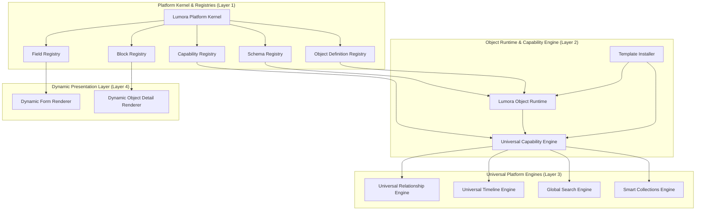
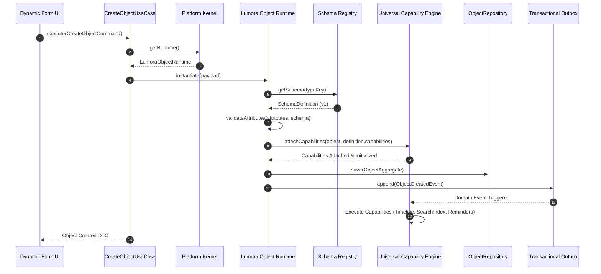

# Lumora Phase 5 Master Architecture Blueprint: Universal Life Operating System Platform

> **Core Mandate**: *"Lumora is a platform, not a collection of features. Every architectural decision must increase the platform's ability to support future object types without requiring rewrites."*

---

## 1. Executive Architectural Blueprint

Phase 5 transforms Lumora from a foundational set of domain services into a fully metadata-driven **Universal Life Operating System Platform**.

In Lumora, **Everything is an Object** (Note, Task, Event, Reminder, Habit, Document, Goal, Recipe, Transaction, Book, Contact, Project, Asset, etc.). Rather than writing custom business logic, database tables, or UI components for every new object type, the platform introduces a quintuple registry & runtime architecture:

1. **Schema Registry**: Controls field schemas, data types, validation rules, display formatters, schema versioning, and default initializers.
2. **Object Definition Registry**: Defines object types (e.g. `note`, `task`, `reminder`, `habit`, `journal_entry`), layout templates, allowed capabilities, icon/color themes, and system traits.
3. **Capability Registry**: Manages capability micro-behaviors and enforces the capability lifecycle (`Register` → `Initialize` → `Attach` → `Execute` → `Suspend` → `Resume` → `Detach`).
4. **Field Registry**: Pluggable form field controls (`Text`, `RichText`, `Markdown`, `Number`, `Toggle`, `Select`, `Date`, `RelationshipPicker`, `LocationPicker`, `Camera`, `MediaPicker`).
5. **Block Registry**: Pluggable detail screen blocks (`TimelineBlock`, `GalleryBlock`, `RelationshipGraphBlock`, `ReminderPanelBlock`, `ChartsBlock`, `AttachmentsBlock`, `NotesBlock`).
6. **Lumora Object Runtime**: Central domain execution engine managing object instantiation, attribute validation, capability attachment, state transitions (`ACTIVE` → `ARCHIVED` → `DELETED`), and event emission.
7. **Lumora Platform Kernel**: Startup orchestrator bootstrapping all registries, capability bindings, and event streams.



---

## 2. Platform Component Architecture & Layering

### 2.1 Folder & Package Structure (`@lumora/shared` & `apps/backend`)

```text
packages/shared/src/
├── core/
│   ├── catalog/                # Object Definition Schemas & Metadata Primitives
│   │   ├── schema-definition.ts
│   │   ├── object-definition.ts
│   │   └── capability-definition.ts
│   ├── capabilities/           # Capability Contracts & Interfaces
│   │   ├── base-capability.ts
│   │   ├── capability-lifecycle.ts
│   │   ├── timeline-capability.ts
│   │   ├── reminder-capability.ts
│   │   └── relationship-capability.ts
│   ├── renderers/              # Field & Block Registry Specifications
│   │   ├── field-definition.ts
│   │   └── block-definition.ts
│   └── templates/              # Template Schema Definitions & Starter Declarations
│       ├── template-definition.ts
│       └── starter-library.catalog.ts

apps/backend/src/
├── domain/
│   ├── catalog/                # Domain Registries
│   │   ├── schema-registry.aggregate.ts
│   │   ├── object-definition-registry.aggregate.ts
│   │   └── capability-registry.aggregate.ts
│   ├── objects/
│   │   └── runtime/            # Lumora Object Runtime Engine
│   │       ├── object-runtime.engine.ts
│   │       └── object-lifecycle.manager.ts
│   ├── templates/              # Domain Template Engine Aggregates
│   │   └── template.aggregate.ts
│   └── relationships/          # Domain Relationship Engine
│       └── object-relationship.aggregate.ts
├── application/
│   ├── catalog/                # Application Use Cases & Queries
│   ├── templates/              # Template Installation Use Cases
│   └── relationships/          # Relationship Management Use Cases
└── infrastructure/
    ├── kernel/                 # Lumora Platform Kernel Bootstrapper
    │   └── platform-kernel.service.ts
    └── catalog/                # Persistence & Metadata Caching
        ├── prisma-schema.repository.ts
        └── redis-schema.cache.ts
```

---

## 3. Core Component Architectures

### 3.1 Schema & Object Definition Registry Architecture
- **Data Flow**:
  1. System initializes with default catalog schemas stored in `@lumora/shared`.
  2. Workspace-specific metadata attributes and custom object definitions are loaded from `SchemaRegistry` and cached in Redis with a 24-hour TTL (`lumora:schema:workspace:<id>`).
  3. Every `CreateObjectCommand` or `UpdateObjectCommand` validates incoming JSON `attributes` against the schema defined in `SchemaRegistry`.
  4. Adding a new object type (e.g. `HabitTracker` or `BookReview`) requires **zero code changes**—only registering an `ObjectDefinition` JSON.

### 3.2 Lumora Object Runtime & Universal Capability Engine
Every domain object inherits universal capabilities automatically through `LumoraObjectRuntime`. Capabilities are decoupled micro-behaviors that attach to object definitions:
- **Capability Lifecycle**: `Register` → `Initialize` → `Attach` → `Execute` → `Suspend` → `Resume` → `Detach`.
- **TimelineCapability**: Automatically records `ObjectCreated`, `ObjectUpdated`, `ObjectArchived` to the global audit stream.
- **ReminderCapability**: Manages time-based or location-based triggers.
- **RelationshipCapability**: Enables bi-directional linking (e.g. `Task` *blocks* `Task`, `Note` *references* `Book`, `Project` *contains* `Task`).
- **MediaAttachmentCapability**: Links file assets seamlessly.

### 3.3 Template Engine & Starter Library Architecture
- **Template Schema**:
  ```json
  {
    "id": "tpl-daily-journal-v1",
    "name": "Daily Reflective Journal",
    "version": "1.0.0",
    "objectDefinitions": [...],
    "capabilities": ["timeline", "media", "organization"],
    "formLayout": { "sections": [...] },
    "detailLayout": { "blocks": [...] }
  }
  ```
- **Starter Library**: Pre-ships built-in starter templates (Daily Planner, Project Tracker, Habit Log, Knowledge Base).
- **Template Lifecycle**: `Installed` → `Activated` → `Updated` → `Exported` → `Archived` → `Deprecated`.

### 3.4 Dynamic Form & Detail Screen Renderers
- **Pluggable Renderers**: Form screens and detail screens render dynamically based on JSON layout blueprints using `FieldRegistry` and `BlockRegistry`.
- **Components**: Field controls (Text, RichText, Markdown, Number, Toggle, Select, Date, RelationshipPicker, LocationPicker, Camera, MediaPicker) and Detail Blocks (Timeline, Gallery, RelationshipGraph, ReminderPanel, Charts, Attachments, Notes) are resolved dynamically without custom screen implementations.

### 3.5 Universal Relationship Engine
- **Graph Primitives**:
  - `sourceObjectId` (UUID)
  - `targetObjectId` (UUID)
  - `relationType` (Enum / String: `DEPENDS_ON`, `PARENTS`, `REFERENCES`, `BLOCKS`, `ATTACHED_TO`)
  - `metadata` (JSON)
- Indexing guarantees $O(1)$ directional graph lookup via `@@index([sourceObjectId, relationType])` and `@@index([targetObjectId, relationType])`.

### 3.6 Universal Search & Global Timeline Architecture
- **Global Search Subsystems**:
  - `QueryParser`: Parses search expressions (`tag:work status:active "project lumora"`).
  - `SearchIndexer`: Listens to domain events and updates `SearchIndex`.
  - `RankingEngine`: Computes relevance scores (BM25 + recency boost).
  - `SearchEngine`: Executes parameterized PostgreSQL full-text queries.
- **Global Timeline**: Consumes domain events (`ObjectCreated`, `ReminderCompleted`, `TimelineRecorded`, etc.) via the Outbox Worker and updates `TimelineRecord` entries asynchronously.

---

## 4. Sequence Diagrams & Lifecycle Flows

### 4.1 Lumora Object Runtime Execution Pipeline



---

## 5. Performance, Security & Future Extension Points

### 5.1 Performance SLA & Budget
- **Schema Resolution**: Cached in Redis with multi-tenant workspace keys; $O(1)$ resolution ($< 2\text{ ms}$).
- **Dynamic Render Speed**: React component layout generation memoized with zero layout shifts; target $< 16\text{ ms}$ (60 fps).
- **Graph Traversal**: Max depth 3 for relationship queries; mandatory keyset pagination.

### 5.2 Security & Multi-Tenancy Boundary
- Workspace isolation enforced on all metadata definitions and capability executions (`@@index([workspaceId])`).
- Schema validation enforces strict type boundaries and prevents arbitrary attribute injection.

### 5.3 Future Extension Points
- **Community Template Hub**: Community members can publish/install versioned templates.
- **AI Consumers**: AI consumers attach as passive subscribers to domain events without polluting core domain models.
